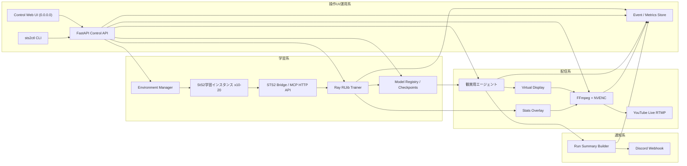

# Discord & YouTube連動: 強化学習AI実況配信 実装プラン

対象: Slay the Spire 2 `public-beta` / Linuxワークステーション / 24時間YouTube Live配信 / Discord自動レポート

## 目的

強化学習エージェントがSlay the Spire 2をゼロから学習していく過程を、観賞用コンテンツとして24時間配信できるシステムを構築する。

このプロジェクトでは、学習速度だけでなく「見ていて面白いこと」を第一級の要件として扱う。大量のバックグラウンド環境で学習を進めつつ、配信用には常に最新のモデルでプレイする観賞用エージェントを1つ走らせ、ゲーム画面・学習統計・行動確率・節目レポートをYouTube LiveとDiscordへ届ける。

## 現時点の前提

- Slay the Spire 2はSteam版を対象にし、ゲームブランチは`public-beta`に固定する。
- 通常ブランチと`public-beta`の2系統がある前提で、実装・検証・学習データ・checkpointはすべて`public-beta`基準にする。
- Steamストア上ではLinux / SteamOS系の動作要件が提示されているため、Linuxサーバー上での実行を主ルートとする。
- Early Accessかつ`public-beta`対象のため、通常ブランチよりもゲーム本体、Mod API、Steam Workshop、内部状態の形式、カード・レリック・敵・イベントの仕様が頻繁に変化しうる。
- STS2_BridgeまたはSTS2MCPのようなHTTP API公開Modを利用する想定だが、実装開始時点で実在リポジトリ、`public-beta`対応状況、対応ゲームbuild ID、ライセンス、API仕様を再確認する。
- Bridge fixture、run log、checkpoint、評価結果にはSteam branch名とbuild IDを必ず記録する。
- 配信キー、Discord Webhook URL、Steam認証情報、YouTube API認証情報はリポジトリに保存しない。

参考:

- Steam Store: https://store.steampowered.com/app/2868840/Slay_the_Spire_2/

## ターゲットハードウェア

CPU:

- AMD Ryzen Threadripper 9960X
- 24 cores / 48 threads
- Slay the Spire 2の複数プロセスと環境マネージャを並列実行する。
- 初期目標は学習用10-20環境 + 観賞用1環境。安定後にCPU使用率、メモリ、プロセス起動時間、ゲーム側の多重起動制約を見ながら上限を伸ばす。

GPU:

- NVIDIA RTX PRO 6000 Blackwell Workstation Edition
- 48GB VRAM
- Transformer系モデル、大きめのミニバッチ、混合精度学習を想定する。
- NVENCでYouTube Live向けRTMP配信を行い、学習用CUDA負荷とエンコード負荷を分離する。

RAM:

- 192GB DDR5 ECC
- 多数のゲームプロセス、観測キャッシュ、ロールアウトバッファ、ログ、動画オーバーレイ素材をオンメモリで扱える。
- PPOの場合はReplay Bufferではなくロールアウトバッファ中心。IMPALA / V-traceやオフポリシー方式を採る場合はlearner queueまたはReplay Bufferを設計する。

OS:

- Linuxベース
- XvfbまたはNVIDIA対応の仮想Xorg環境を使い、ゲーム描画と配信キャプチャを行う。
- Godot側のGPU描画や入力制御がXvfbだけで不安定な場合は、Xorg dummy display、gamescope、weston headlessなどの代替を検証する。

## 全体アーキテクチャ



## 主要コンポーネント

### 1. Game Bridge Adapter

役割:

- Slay the Spire 2 Modが公開するHTTP APIをPythonから扱う。
- ゲーム状態、合法行動、行動実行、リセット、seed指定、run終了イベントを標準化する。

責務:

- `GET /state`相当の呼び出しを内部表現へ変換する。
- `GET /actions`相当の合法行動リストをaction maskへ変換する。
- `POST /act`相当で選択行動を実行する。
- タイムアウト、ゲームクラッシュ、Mod未応答、バージョン不一致を検出する。
- Bridge実装差分を吸収し、RL側に安定したGymnasium風APIを提供する。

実装方針:

- `sts2_bridge`のような薄いPythonパッケージに閉じ込める。
- Bridgeが未確定の間は、APIレスポンスをfixture化し、学習コードを先に組めるようにする。
- APIスキーマはJSON SchemaまたはPydantic modelで明文化する。

### 2. RL Environment

役割:

- Ray RLlibから利用できるカスタム環境を提供する。
- 可変長アクションと複雑な観測を、モデルが扱える形式へ変換する。

観測候補:

- プレイヤー: HP、最大HP、ブロック、エナジー、状態異常、キャラクター種別。
- 戦闘: 手札、山札、捨て札、廃棄札、敵HP、敵意図、敵バフ・デバフ。
- デッキ構築: デッキ全体、レリック、ポーション、ゴールド、報酬候補。
- マップ: 現在階層、次ノード候補、エリート/焚火/ショップ/イベント/ボスへの距離。
- 履歴: 直近のカード使用、被ダメージ、報酬選択、敗北パターン。

行動候補:

- 戦闘中: カード使用、対象選択、ポーション使用、ターン終了。
- 非戦闘: 報酬カード選択、スキップ、レリック取得、ショップ購入、休憩/鍛冶、マップ遷移、イベント選択。
- すべての状態でBridgeから返る合法行動だけを選べるよう、action maskを必須にする。

報酬設計:

- 初期はスパース報酬を避け、学習の立ち上がりを優先する。
- 例: 戦闘勝利、階層到達、エリート撃破、ボス撃破、被ダメージ抑制、デッキ価値、不要カード回避。
- 報酬ハックを避けるため、最終評価は「run到達階層」「Act 1ボス撃破率」「勝率」「平均HP推移」を重視する。

### 3. Policy / Model

初期実装:

- RLlib PPO + PyTorch。
- action mask対応のカスタムモデル。
- カード、レリック、敵、行動候補をトークン化し、埋め込み + Transformer encoderで処理する。
- 最初のMVPでは過度に巨大なモデルにせず、学習パイプラインの安定を優先する。

拡張候補:

- IMPALA / APPOで環境生成と学習をより非同期化する。
- GTrXLやDecision Transformer風の履歴条件付きモデルを検証する。
- 価値関数、行動種別ヘッド、対象選択ヘッドを分離する。
- 人間プレイログやルールベースエージェントからの事前学習を追加する。

### 4. Environment Manager

役割:

- 複数のゲームプロセス、Bridgeポート、仮想ディスプレイ、プロファイルディレクトリを管理する。

設計要点:

- 各インスタンスに一意の`env_id`、`DISPLAY`、Bridge port、Steam/userdata/profile pathを割り当てる。
- プロセス起動、ヘルスチェック、クラッシュ時再起動、ログ収集を行う。
- 学習用インスタンスは配信しない。可能なら最小解像度・低描画設定・高速進行を使う。
- Steamやゲーム側が多重起動を制限する場合、正式に許容される方法を確認し、無理な回避はしない。

### 5. Spectator Agent

役割:

- 学習とは非同期で、最新の安定checkpointを読み込み続ける観賞用プレイヤー。
- YouTube Liveに映る唯一のゲーム画面を担当する。

設計要点:

- 学習中checkpointを直接読むのではなく、Trainerがatomicにpublishした`latest_stable`を読む。
- モデル更新はrun終了時または安全な節目で行い、プレイ中に挙動が急変しないようにする。
- 配信用は見栄えを優先し、解像度、UI倍率、オーバーレイ、行動選択の間を調整する。
- 必要に応じて「思考時間」を0.3-1.0秒ほど入れ、視聴者が行動を追える速度にする。

### 6. Broadcast Pipeline

構成:

- 仮想ディスプレイ: XvfbまたはNVIDIA対応Xorg
- キャプチャ: FFmpeg `x11grab`
- エンコード: `h264_nvenc`または`hevc_nvenc`
- 送信: YouTube RTMP

検証項目:

- `ffmpeg -encoders`でNVENCが有効か。
- `nvidia-smi`でエンコード負荷が見えるか。
- 1080p60、1080p30、1440p30のどれが安定するか。
- 長時間配信時の音声なし/あり、フレーム落ち、RTMP再接続、YouTube側の切断復帰。

初期推奨:

- 1920x1080 / 30fps / H.264 NVENC / CBR 6-9Mbps。
- 安定後に60fps化またはビットレート増加を検証する。

### 7. Overlay

初期表示:

- 現在のrun番号。
- 総学習step。
- 現在階層。
- 直近100 runのAct 1ボス到達率/撃破率。
- 現在の主要カード/レリック。
- 直近のloss、policy entropy、value loss、reward moving average。
- 現在選ぼうとしている上位行動候補と確率。

実装候補:

- Pythonで透過PNGを定期生成しFFmpegで合成。
- OBSを使わずFFmpeg filter_complexで完結させる。
- 後続でWeb overlayを作り、Browser source相当をキャプチャする。

### 8. Discord Reporter

通知タイミング:

- 1 run終了時。
- Actボス撃破時。
- 初回到達記録更新時。
- 一定学習stepごとの定期サマリー。
- 長時間クラッシュ、配信切断、Bridge異常などの運用アラート。

run終了サマリー:

- run ID、キャラクター、seed。
- 到達階層、最終戦闘、死亡理由または勝利情報。
- 主要カード、主要レリック、削除カード、キーカード取得タイミング。
- Act別の勝率/到達率。
- 直近モデルとの差分。
- YouTube Live URL。

実装方針:

- Discord WebhookへJSON payloadをPOSTする。
- リトライ、rate limit、失敗ログを実装する。
- Webhook URLは`.env`またはシークレットマネージャから読む。

### 9. Control Plane / Web Dashboard

役割:

- Ubuntu CUI運用でも、ブラウザから学習・配信・観賞用プレイを操作できる管制画面を提供する。
- 学習進捗、現在のプレイ状況、ログ、プロセス状態、checkpoint状態を1画面で確認できるようにする。
- 起動、停止、再起動、モデルリセット、checkpoint切り替えなどの運用操作を安全に実行する。

初期画面:

- Overview: 学習中/停止中、配信中/停止中、観賞用エージェント状態、Discord通知状態、現在の`public-beta` build ID。
- Training: 総step、episodes、直近reward、Act到達率、loss、entropy、GPU/CPU/RAM使用率。
- Spectator: 現在階層、HP、デッキ、レリック、直近行動、上位行動確率、run履歴。
- Logs: trainer、env pool、spectator、ffmpeg、discord reporter、bridgeのtail表示。
- Models: checkpoint一覧、`latest_stable`、`best_act1`、現在配信中モデル、モデルリセット/切り替え。
- Controls: 学習開始/停止、配信開始/停止、観賞用エージェント再起動、Discordテスト通知、smoke test実行。

操作API:

- `GET /api/status`: 全プロセス、build ID、配信状態、最新metrics。
- `GET /api/logs/{service}`: サービス別ログtail。
- `POST /api/training/start` / `POST /api/training/stop` / `POST /api/training/restart`。
- `POST /api/broadcast/start` / `POST /api/broadcast/stop` / `POST /api/broadcast/restart`。
- `POST /api/spectator/start` / `POST /api/spectator/stop` / `POST /api/spectator/restart`。
- `POST /api/models/promote`: checkpointを`latest_stable`や`best_act1`へ昇格。
- `POST /api/models/reset`: 新しい学習run namespaceを作り、optimizer/model stateを初期化する。
- `POST /api/discord/test`: Discord Webhookへの疎通確認。

実装方針:

- Python/FastAPIでControl APIを実装し、軽量なHTML UIを同梱する。初期はJinja2 + HTMXまたはSSE/WebSocketで十分とする。
- `CONTROL_HOST=0.0.0.0`でbindし、UbuntuサーバーのIPへブラウザから接続できるようにする。
- 同じ操作をCUIから実行できる`sts2ctl` CLIも用意し、Web UIとCLIは同じControl APIを叩く。
- プロセス操作は直接shellを組み立てず、systemd unit、supervisor、Ray Jobs API、内部Process Managerのいずれかを経由する。
- すべての操作は`operator`, `action`, `target`, `timestamp`, `result`をaudit logへ記録する。
- モデルリセットは既存checkpointを削除せず、新しいrun namespaceを作る。破棄や削除は明示的な別操作に分ける。

セキュリティ:

- 0.0.0.0公開のため、初期実装から`CONTROL_AUTH_TOKEN`によるBearer token認証を必須にする。
- destructive寄りの操作、特にモデルリセット、checkpoint削除、全プロセス停止は確認tokenまたは二段階確認を要求する。
- 可能ならファイアウォールで接続元IPを絞る。インターネットへ直接公開する場合はTLS、Basic/Bearer認証、reverse proxy、rate limitを必須にする。
- Control UIにYouTube stream key、Discord Webhook URL、Steam認証情報を表示しない。

### 10. Telemetry / Output Contract

役割:

- 学習進捗、プレイ状況、配信状態、運用操作を、Web UI、CLI、Discord、将来の分析が共通利用できる形式で出力する。

出力形式:

- JSONL: 長時間運用に強い主ログ形式。`data/logs/*.jsonl`へ追記する。
- SQLiteまたはDuckDB: Web UIでrun履歴やcheckpoint履歴を高速に引くための軽量DB。
- TensorBoard/W&B互換metrics: 学習曲線の確認用。
- Plain text log: systemdやtailで見るための人間向けログ。

主要イベント:

- `training.metrics`: step、episode、reward、loss、entropy、value loss、learning rate、GPU/CPU/RAM。
- `run.started`: run ID、character、seed、model ID、steam branch/build ID。
- `run.step`: floor、HP、gold、deck size、current action、action probabilities。
- `run.ended`: 到達階層、死亡/勝利、主要カード、主要レリック、報酬合計。
- `model.checkpointed`: checkpoint path、model ID、schema version、評価値。
- `model.promoted`: alias、旧model ID、新model ID、operator。
- `model.reset`: old namespace、新namespace、operator、reason。
- `broadcast.status`: ffmpeg PID、RTMP接続状態、fps、dropped frames、bitrate。
- `control.action`: operator、action、target、result、request ID。

CLI出力:

- `sts2ctl status`: 学習、配信、観賞用エージェント、Discord、Bridge、build IDを1画面に要約する。
- `sts2ctl logs trainer --follow`: サービス別にtailする。
- `sts2ctl runs --last 20`: 直近runの成績を表で出す。
- `sts2ctl models`: checkpointとaliasを一覧する。
- `sts2ctl reset-model --reason "..."`
  は既存checkpointを保持したまま新しい学習namespaceを作る。

## フェーズ計画

### Phase 0: 仕様確認と薄い土台

目的:

- 本格実装前に、ゲーム起動、Mod API、Linux描画、配信、秘密情報の扱いを確認する。

作業:

- Steam版Slay the Spire 2のLinux実行方式を確認する。
- SteamクライアントまたはSteamCMDで`public-beta`ブランチが選択できることを確認する。
- `public-beta`のbuild ID、ゲーム内バージョン表記、更新日時を記録する。
- STS2_Bridge / STS2MCP候補の実在、`public-beta`対応ゲームバージョン、API仕様、ライセンスを確認する。
- Bridge未確定時のためのmock APIとfixtureを作る。
- `.env.example`を作り、必要な環境変数を定義する。
- ログ、checkpoint、run artifactの保存ディレクトリ方針を決める。

完了条件:

- Modなしでもmock環境でRLコードの単体テストが走る。
- `public-beta`ブランチを明示してゲームを起動できる。
- すべてのrun artifactに`steam_branch=public-beta`とbuild IDが入る。
- 本物のBridge候補について「使う/作る/待つ」の判断ができる。

### Phase 0.5: CUI運用向けControl Plane MVP

目的:

- UbuntuのCUI環境でも、SSH接続先のブラウザから状態確認と基本操作ができるようにする。

作業:

- FastAPIベースのControl APIを作る。
- `CONTROL_HOST=0.0.0.0`、`CONTROL_PORT=8080`で起動できるようにする。
- Bearer token認証を必須にする。
- Overview、Training、Spectator、Logs、Models、Controlsの最小Web UIを作る。
- `sts2ctl status/start/stop/restart/logs/reset-model`のCLIを作る。
- mock trainer / mock spectator / mock broadcastを対象に、起動・停止・ログtail・モデルリセットのdry runを実装する。
- 操作audit logをJSONLで保存する。

完了条件:

- Ubuntuサーバー上で`0.0.0.0:8080`にbindし、別端末のブラウザからControl UIへアクセスできる。
- tokenなしのアクセスが拒否される。
- Web UIとCLIのどちらからでもstatus確認、ログ確認、mockプロセスのstart/stop/restartができる。
- モデルリセットは既存checkpointを消さず、新しいrun namespaceを作る挙動になっている。

### Phase 1: ヘッドレス環境構築とYouTube配信テスト

目的:

- 1つのSlay the Spire 2プロセスをLinux上で描画し、YouTube LiveへRTMP配信できることを確認する。

作業:

- `public-beta`を選択した状態のゲームにModを導入する。
- .NET 9 SDKが必要なModの場合、ビルド・導入手順をスクリプト化する。
- 仮想ディスプレイ上でゲームを起動する。
- Bridge APIから状態取得と行動実行を行う最小Pythonクライアントを作る。
- Bridge起動時にゲームbranch/build IDを取得し、期待値と違う場合は学習を止める。
- FFmpegをPythonサブプロセスから起動する。
- FFmpeg配信プロセスをControl UI/CLIから開始・停止・再起動できるようにする。
- NVENC有効化、RTMP push、切断時再接続を確認する。
- 配信用の最小overlayを入れる。

完了条件:

- 観賞用1インスタンスが30分以上落ちずに配信できる。
- Pythonから合法行動を取得し、ランダムまたはルールベースで1 runを完走/死亡まで進められる。
- branch/build mismatch時に明確なエラーで停止する。
- Control UIに配信状態、FFmpegログ、直近フレーム/接続状態が出る。
- Discordへ手動テスト通知が送れる。

### Phase 2: マルチプロセス強化学習パイプライン

目的:

- ThreadripperのCPUコアを使い、複数ゲームインスタンスから経験を集めてGPUで学習する。

作業:

- Ray cluster / RLlib設定を作る。
- 学習用インスタンス10-20個の起動、ヘルスチェック、再起動を実装する。
- 全学習用インスタンスが同じ`public-beta` build IDで起動していることを起動時に検証する。
- Gymnasium互換環境を実装する。
- action mask対応モデルを実装する。
- PPOのrollout length、batch size、num workers、GPU利用率を調整する。
- runごとのmetricsをParquet/JSONL/TensorBoard/W&B互換形式で保存する。
- 学習進捗をEvent/Metrics Storeへ流し、Control UIでリアルタイム表示する。
- Control UI/CLIから学習のstart/stop/restart、checkpoint保存、モデルリセットを実行できるようにする。

完了条件:

- 10環境以上で24時間学習を継続できる。
- checkpointが定期保存され、再開できる。
- Control UIから総step、episode数、loss、reward、Act到達率、GPU/CPU/RAM使用率を確認できる。
- Act 1序盤でランダムより明確に良い指標が出る。

### Phase 3: 観賞用エージェント統合

目的:

- 学習ループと別に、最新モデルで常時プレイする配信用プロセスを動かす。

作業:

- Model Registryに`latest`, `latest_stable`, `best_act1`などのaliasを持たせる。
- Model Registryのmetadataに`steam_branch`, `steam_build_id`, `bridge_version`, `schema_version`を保存する。
- Spectator Agentが安全なタイミングでcheckpointをreloadする。
- Spectator Agentは現在の`public-beta` build IDとcheckpointのbuild IDが違う場合、互換性ありと明示されたcheckpointだけを読む。
- Overlayに学習統計、行動確率、モデル世代を表示する。
- Control UIに観賞用エージェントの現在階層、HP、デッキ、レリック、直近行動、行動確率を表示する。
- Control UI/CLIから観賞用エージェントのrestart、checkpoint切り替え、速度設定変更を行えるようにする。
- 視聴しやすい速度制御を入れる。
- 配信プロセス、学習プロセス、Discord通知を同時稼働させる。

完了条件:

- 学習が続いていても配信画面が止まらない。
- 最新モデルの改善が配信上で追える。
- 1 run終了ごとに配信用サマリーが生成される。
- Control UI上で現在のプレイ状況と過去run履歴を確認できる。

### Phase 4: Discord自動レポート

目的:

- 観賞用エージェントの節目をDiscordへ自動通知する。

作業:

- run event streamを作る。
- run終了、ボス撃破、記録更新、異常終了をイベント化する。
- Discord Embed形式のレポートを作る。
- 主要カード、敗北原因、判断ログを要約する。
- YouTube Live URL、checkpoint ID、run replay/logへの参照を添付する。

完了条件:

- run終了時にDiscordへ成績サマリーが自動投稿される。
- ボス撃破や最高到達階層更新が別通知される。
- Webhook失敗時にリトライされ、学習本体を止めない。

### Phase 5: 長時間運用と品質改善

目的:

- 24時間以上の運用に耐える状態へ仕上げる。

作業:

- systemd unitまたはDocker Composeでプロセス管理する。
- Control UIを標準の運用入口にし、必要に応じてPrometheus/Grafanaも併用する。
- ディスク使用量、checkpoint世代管理、ログローテーションを入れる。
- YouTube RTMP切断、`public-beta`更新、Steamアップデート、ゲームクラッシュ、Bridge破損を想定した復旧を実装する。
- `public-beta`更新直後はsmoke test、Bridge schema検証、短時間評価を通してから24時間運用へ戻す。
- モデル評価ジョブを定期実行し、配信用モデルが悪化し続けないようにする。
- Control UIのaudit log、認証、rate limit、重要操作の二段階確認を確認する。

完了条件:

- 配信、学習、通知が24時間以上継続稼働する。
- 障害時に原因を追えるログとメトリクスが残る。
- 手動再起動後にcheckpointから再開できる。
- CUIに直接張り付かなくても、Control UI/CLIから主要操作を完結できる。

## 初期ディレクトリ案

```text
.
├── PLAN.md
├── README.md
├── .env.example
├── configs/
│   ├── train_ppo.yaml
│   ├── broadcast.yaml
│   ├── env_pool.yaml
│   └── control.yaml
├── src/
│   └── sts2_ai_stream/
│       ├── bridge/
│       ├── env/
│       ├── models/
│       ├── training/
│       ├── spectator/
│       ├── broadcast/
│       ├── discord/
│       ├── control/
│       └── telemetry/
├── scripts/
│   ├── launch_env_pool.sh
│   ├── start_training.sh
│   ├── start_broadcast.sh
│   ├── start_control_server.sh
│   ├── check_steam_branch.py
│   ├── sts2ctl
│   └── smoke_test_bridge.py
├── tests/
│   ├── fixtures/
│   ├── test_bridge_adapter.py
│   ├── test_action_mask.py
│   ├── test_run_summary.py
│   └── test_control_api.py
├── data/
│   ├── checkpoints/
│   ├── runs/
│   ├── logs/
│   └── audit/
└── docs/
    ├── operations.md
    ├── control_ui.md
    ├── bridge_api.md
    └── streaming.md
```

`data/`は原則として`.gitignore`対象にする。

## 環境変数案

```text
STS2_STEAM_APP_ID=2868840
STS2_STEAM_BRANCH=public-beta
STS2_EXPECTED_BUILD_ID=
STS2_GAME_PATH=/path/to/slay_the_spire_2
STS2_BRIDGE_BASE_PORT=15526
STS2_ENV_COUNT=10
STS2_DISPLAY_BASE=:100

CONTROL_HOST=0.0.0.0
CONTROL_PORT=8080
CONTROL_PUBLIC_BASE_URL=http://your-server-ip:8080
CONTROL_AUTH_TOKEN=replace-me
CONTROL_AUDIT_LOG=data/audit/control.jsonl

YOUTUBE_RTMP_URL=rtmp://a.rtmp.youtube.com/live2
YOUTUBE_STREAM_KEY=replace-me
YOUTUBE_LIVE_URL=https://www.youtube.com/watch?v=replace-me

DISCORD_WEBHOOK_URL=https://discord.com/api/webhooks/replace-me

WANDB_API_KEY=
RAY_ADDRESS=auto
CUDA_VISIBLE_DEVICES=0
```

## 最初のMVPスコープ

MVPでは、AIの賢さよりも配信と学習の管が全部つながることを優先する。

含める:

- BridgeのPythonクライアント。
- 1つのゲーム環境を操作するGymnasium環境。
- ランダムまたは単純ルールベースエージェント。
- Xvfb/Xorg + FFmpeg + NVENCの配信テスト。
- Discordへのrun終了サマリー投稿。
- `0.0.0.0:8080`で動くControl UI/API。
- `sts2ctl` CLIによるstatus、start、stop、logs、reset-model。
- mock BridgeによるCI可能な単体テスト。

含めない:

- 巨大Transformerの本格チューニング。
- 20環境以上の最適化。
- 自動クリップ生成。
- 高度な自然言語実況。
- 複数キャラクター横断学習。

## 学習目標

初期目標:

- 初期キャラクター1体でAct 1ボス撃破率を上げる。
- ランダム方策より高い平均到達階層を安定して出す。
- 観賞用エージェントが1 runごとに見て分かる成長を示す。

中期目標:

- Act 2到達率の改善。
- キャラクター別モデルまたは共有モデルの比較。
- 報酬設計とモデル構造のA/Bテスト。

長期目標:

- 全Actクリア。
- 複数キャラクター対応。
- 視聴者向けの自然言語解説、投票、週間成長レポート。

## 運用・安全設計

- 配信キー、Webhook、Steam認証情報は`.env`または外部secret storeで管理する。
- `.env`, checkpoint, run logs, raw screenshots, crash dumpsは不用意に公開しない。
- YouTubeとDiscordのrate limit、利用規約、ゲーム配信ガイドラインを確認する。
- Steamクライアントやゲームの多重起動が規約・技術上問題ないか確認する。
- Control UIは`0.0.0.0`でbindするため、token認証、重要操作の二段階確認、audit logを必須にする。
- Mod導入はゲーム本体のアップデートで壊れる前提で、バージョン固定と復旧手順を用意する。
- 学習用プロセスが暴走した場合に備え、CPU/GPU/メモリ上限とプロセス監視を置く。

## 主要リスク

Bridge未確定:

- STS2_Bridge / STS2MCPが未成熟、存在しない、または`public-beta`に追従していない場合、内部状態取得Modを自作する必要がある。
- 対策: mock APIで学習・配信側を先行実装し、Bridge層だけ交換可能にする。

`public-beta`更新:

- `public-beta`は通常ブランチより更新頻度が高く、カード、敵、イベント、内部状態schema、Mod ABIが突然変わる可能性がある。
- 対策: Steam build ID、Bridge schema version、fixture versionを成果物に記録し、更新後はsmoke testと短時間評価を必須にする。

ゲーム多重起動:

- Steamやゲーム本体が複数インスタンスに向かない可能性がある。
- 対策: まず1-2インスタンスで検証し、プロファイル分離、port分離、公式に許容される起動方法を確認する。

Xvfb描画:

- Godot + Vulkan/OpenGL + Xvfbの組み合わせが不安定な可能性がある。
- 対策: Xorg dummy、gamescope、weston headless、低描画設定を代替ルートとして検証する。

RL学習の難易度:

- Slay the Spire系は長期計画、デッキ構築、可変アクションが重く、単純PPOでは伸びにくい可能性がある。
- 対策: 報酬 shaping、action mask、履歴モデル、ルールベースwarm start、人間ログ事前学習を段階導入する。

配信安定性:

- 24時間配信ではRTMP切断、YouTube側の制限、FFmpeg停止が起きうる。
- 対策: watchdog、再接続、状態保存、Discord運用アラートを入れる。

Control UI公開:

- `0.0.0.0`でbindするControl UIは、学習停止やモデルリセットなど強い操作権限を持つ。
- 対策: token認証、重要操作の二段階確認、audit log、ファイアウォール、接続元制限、必要に応じたSSH tunnel運用を必須にする。

## 未決定事項

YouTube配信レイアウト:

- 案A: ゲーム画面を大きく表示し、下部に学習統計バーを置く。
- 案B: 右側にAIパネルを置き、勝率、学習step、行動確率、直近run結果を表示する。
- 案C: ゲーム画面 + 小さなログティッカー + Discord風サマリー枠。

学習の初期ゴール:

- 案: 初期キャラクターでAct 1ボス撃破を最初の公開目標にする。

Discord報告タイミング:

- 案: 1 run終了時を基本に、初ボス撃破、最高到達階層更新、モデル更新時だけ追加通知する。

モデル方針:

- 案A: PPOでまず安定パイプラインを作る。
- 案B: APPO/IMPALAで並列環境のスループットを優先する。
- 案C: ルールベースや探索方策で初期データを作ってからRLに移行する。

## 次に作るもの

1. `README.md`: プロジェクト概要、前提ツール、起動方法。
2. `.gitignore`: secrets、data、checkpoint、logsを除外。
3. `.env.example`: 必須環境変数の雛形。
4. `src/sts2_ai_stream/bridge/`: Bridge adapterとmock client。
5. `tests/fixtures/`: Bridgeレスポンスfixture。
6. `scripts/check_steam_branch.py`: `public-beta` branch/build ID確認。
7. `src/sts2_ai_stream/control/`: FastAPI Control APIと最小Web UI。
8. `scripts/start_control_server.sh`: `0.0.0.0:8080`でControl UIを起動するスクリプト。
9. `scripts/sts2ctl`: CUIからControl APIを操作するCLI。
10. `scripts/smoke_test_bridge.py`: Bridge接続確認。
11. `scripts/start_broadcast.sh`: 仮想ディスプレイ + FFmpeg配信の最小検証。
